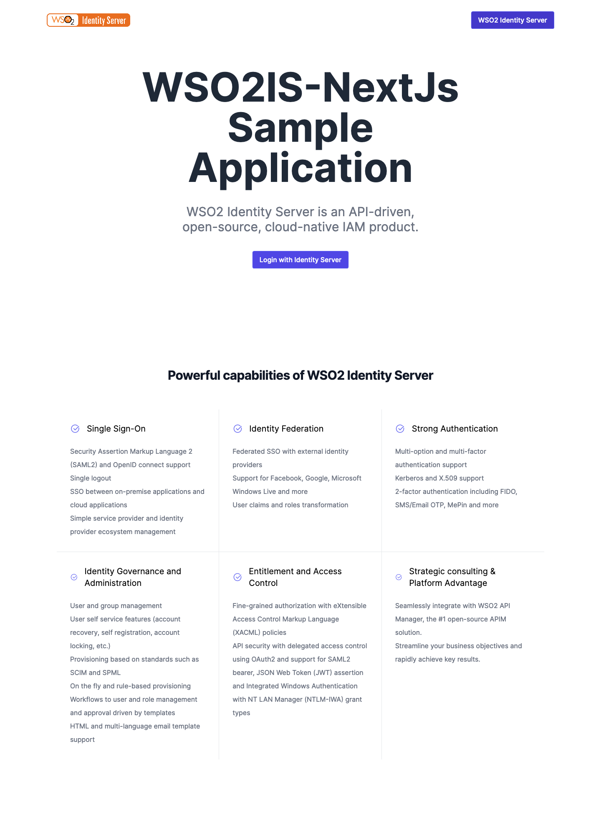

  

## 🚀 Getting started

Clone this repository and checkout v1.0 branch. Run the following commands on the terminal inside the project folder:

1. Run `cp .env.local.example .env.local`
2. Run `yarn`
3. Run `yarn dev`

To view the project open `http://localhost:3000`

## 📝 License

This project is licensed under the MIT License - see the [LICENSE.md](LICENSE.md) file for more information.
